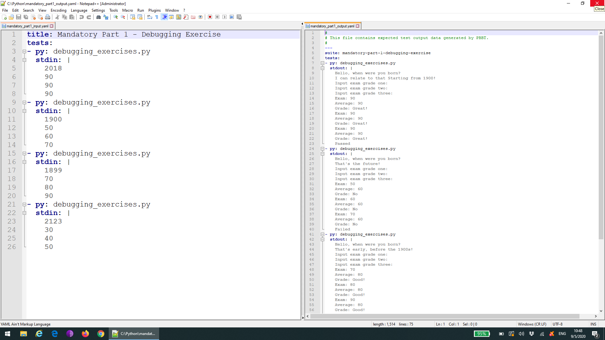

How to install and use Python Black Box Tool (PBBT)
=============================================================

First install pbbt through the command line using pip:

```pip install pbbt```


How to use Python Black Box Tool (PBBT)
=============================================================

Then download all the code from the github repository. Navigate to where you saved all the code files, in my case `C:\Python\`, using `cd path`

```cd C:\Python```

Now it is important to copy all python files to the Python directory to ensure that PBBT can find the necessary imports correctly, for Windows this would look like:

```COPY *.py %LOCALDATA%\Programs\Python\Python38```

Overwrite all files with your own latest versions when asked to do so. Otherwise, the tests might still be failing, because you are using the old version.

Now it is time to run to run PBBT through the command line with `pbbt input.yaml output.yaml`. For the first exercise, i.e. `debugging_exercises.py`, this will be as follows:

```pbbt mandatory_part1_input.yaml mandatory_part1_output.yaml```


How does Python Black Box Tool (PBBT) work
=============================================================

When we look inside the input.yaml and output.yaml for the first exercise, we will see the following:



Basically we have 4 different input-output tests running over here. We provide different answers to the program and see whether everything matches correctly.

The input output test cases are also defined in the Microsoft Word document testcases.docx, which is provided inside the [code folder](../code/)
